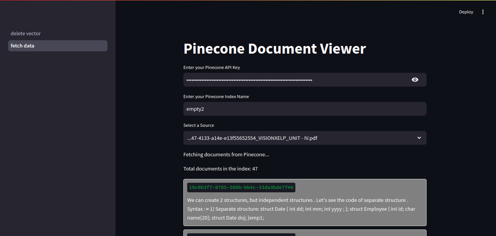
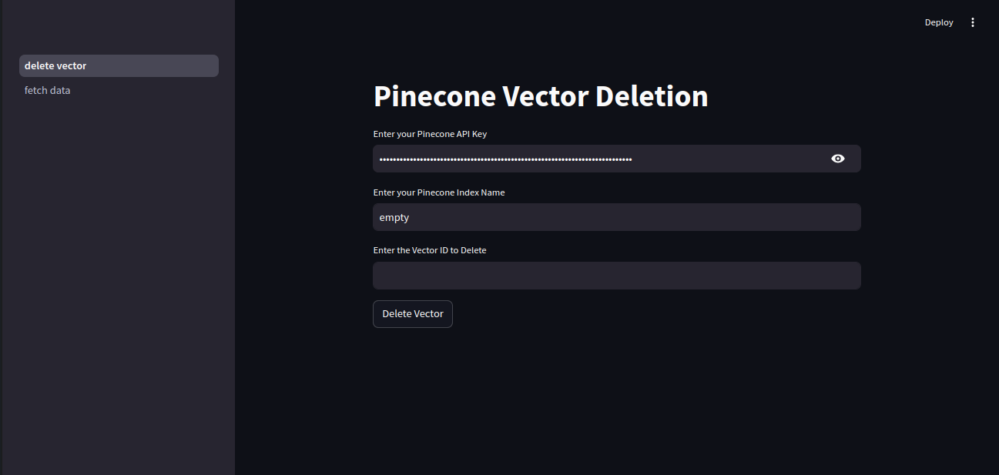

# Project: Pinecone Query App with Record Manager

## Description
This project provides a Python-based solution to interact with Pinecone for vector search and to manage records in a Supabase database table. It includes functionalities to fetch keys, retrieve unique group IDs, delete records by their keys, and query Pinecone for vector metadata. The project leverages the `psycopg2` library to interact with the PostgreSQL database and Pinecone's Python client.

## Features
1. **Fetch Keys:** Retrieve a list of keys based on namespace and group ID.
2. **Get All Group IDs:** Retrieve all unique group IDs for a given namespace.
3. **Delete Record by Key:** Delete a specific record from the database using its key.
4. **Query Pinecone:** Fetch and display vector metadata from a Pinecone index.

## Requirements
- Python 3.x
- psycopg2 library
- Pinecone Python client

## Installation
1. Clone the repository.
   ```bash
   git clone https://github.com/your-repo/pinecone-query-app.git
   ```
2. Navigate to the project directory.
   ```bash
   cd pinecone-query-app
   ```
3. Install the required dependencies.
   ```bash
   pip install psycopg2 pinecone-client
   ```

## Usage

### Database Configuration
Update the `conn_string` variable in the code with your Supabase database connection string:
```python
conn_string = "postgresql://<username>:<password>@<host>:<port>/<database>"
```


## Example Workflow
1. Fetch all group IDs for a namespace.
2. Select a group ID and fetch keys associated with it.
3. Use the keys to query Pinecone for vector metadata.
4. Optionally delete records from Supabase by their keys.

## Screenshots

### Screenshot 1: Fetching Pinecone


### Screenshot 2: Delete from Pinecone


## License
This project is licensed under the MIT License. See the LICENSE file for details.

## Contributing
Contributions are welcome! Please open an issue or submit a pull request on GitHub.

